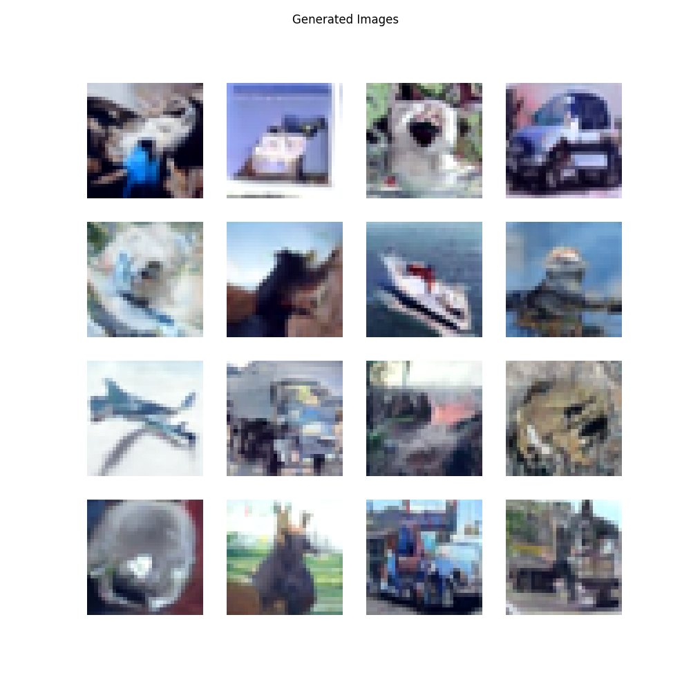

# Tiny DDPM

This is a bare bones and simple DDPM ([Denoising Diffusion Probabilistic Models](https://arxiv.org/abs/2006.11239)) implementation on PyTorch. The whole implementation (model + training + sampling) does not exceed 400 lines of code. The training setup and U-Net model loosely resemble the description of the original paper, but it is not a 1 to 1 implementation.



These images were generated after training on CIFAR-10 for 256 epochs on a single RTX 4090.

# Usage

## Installation

It is recommended (but not required) to use [uv](https://github.com/astral-sh/uv) to replicate the Python environment:

```bash
uv sync                 # If using uv
python -m pip install . # Otherwise
```

## Training

```bash
uv run src/simple_ddpm/train.py # If using uv
python src/simple_ddpm/train.py # Otherwise
```
## Training

```bash
uv run src/simple_ddpm/sample.py # If using uv
python src/simple_ddpm/sample.py # Otherwise
```
